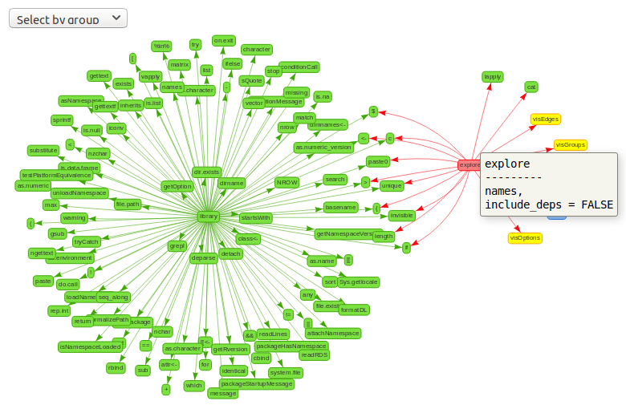

Interactively explore functions dependencies.

## Installation
`packageexplorer` is currently only available as a GitHub package.
To install it run the following from an R console:
```{r eval = FALSE}
if (!require("remotes"))
  install.packages("remotes")
remotes::install_github("jcrodriguez1989/packageexplorer")
```

## Usage

```{r, eval = FALSE}
library("packageexplorer")
explore(c("package:packageexplorer", "base::library"), include_deps = TRUE)
```

    ## Going to explore packages:
    ## 	 packageexplorer 
    ## Going to explore functions:
    ## 	 base::library

```{r, echo = FALSE}

```

